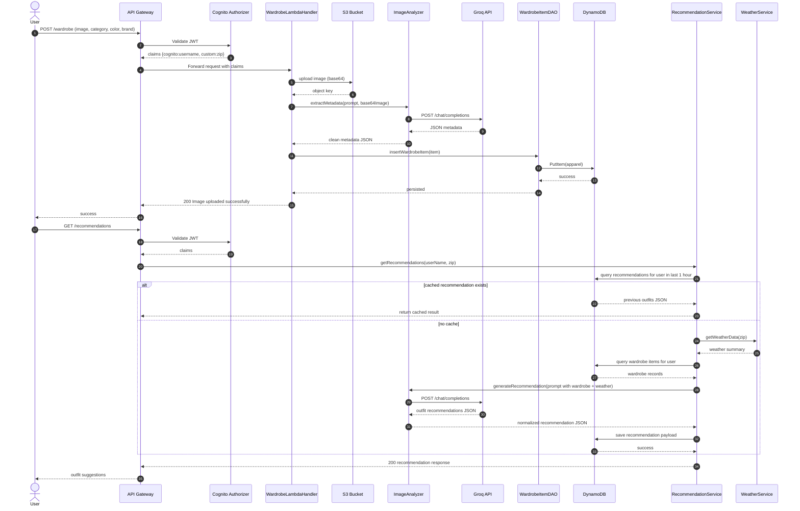

High-Level Design Document

Overview

This project is a serverless, AWS-based wardrobe intelligence backend. It authenticates users through Cognito, stores user and wardrobe data in DynamoDB, stores uploaded images in S3/CloudFront, and uses Groq-hosted LLMs to extract visual metadata and generate outfit recommendations based on the user’s wardrobe and weather.

Core architecture

- API layer:
    - Amazon API Gateway exposes Lambda endpoints for wardrobe, categories, recommendations, and dashboard statistics.
    - Cognito authorizer injects JWT claims like cognito:username and custom:zip into request context.
- Compute layer:
    - Java AWS Lambda handlers under src/main/java/com/layrly/lambda
    - Shared base handler extracts user identity from API Gateway JWT claims
- Data layer:
    - DynamoDB tables:
        - users
        - apparel
        - category
        - recommendations
        - login_history
    - BaseDAO centralizes the DynamoDB client and common query/transaction wrappers.
- Storage/asset layer:
    - S3 stores uploaded wardrobe images
    - CloudFront domain exposes image URLs for frontend use
- AI layer:
    - ImageAnalyzer calls Groq OpenAI-compatible chat/completions endpoint
    - One call extracts clothing metadata from the uploaded image
    - Another call generates outfit recommendations using wardrobe JSON + weather JSON

Key components by responsibility

1. Authentication and user lifecycle
- PreAuthorizerLambdaHandler:
    - Runs during Cognito signup/login flow
    - Reads userAttributes and creates/updates user records in the users table
    - Auto-confirms and auto-verifies email/phone
- PostAuthenticationLambdaHandler:
    - Runs after successful auth
    - Records login events in login_history

2. Wardrobe management
- WardrobeLambdaHandler:
    - Reads authenticated user from request context
    - Accepts base64 image upload
    - Stores image in S3 under ui/images/
    - Sends image to Groq for metadata extraction
    - Inserts a WardrobeItem into the apparel table
- WardrobeListLambdaHandler:
    - Queries items for the logged-in user
    - Supports filtering by category
    - Rewrites image paths to CloudFront URLs
- WardrobeEditLambdaHandler:
    - Updates category/color/brand for a specific item
    - Validates ownership using user_name + apparel_id
- WardrobeDeleteLambdaHandler:
    - Deletes a wardrobe item only if it belongs to the authenticated user

3. Recommendation engine
- RecommendationLambdaHandler:
    - Validates auth/jwt claims
    - Calls RecommendationService
- RecommendationService:
    - Checks the recommendations table for a recent cached result in the last hour
    - Reads current weather for the user ZIP
    - Loads all wardrobe items for the user
    - Converts AI metadata JSON into prompt-friendly data
    - Calls Groq to generate outfit suggestions
    - Deduplicates apparel IDs and attaches image URLs
    - Saves the response in recommendations for caching

4. Dashboard and reference data
- DashboardLambdaHandler:
    - Runs concurrent DAO queries for:
        - recommendation count
        - wardrobe item count
        - recent login streak
        - category count
- CategoryLambdaHandler:
    - Scans the category table and returns ordered categories

Data model highlights

- User record:
    - user_name, name, email, gender, zip
- Wardrobe item record:
    - user_name, apparel_id, image_url, category, color, brand, ai_description, created_at
- Recommendation record:
    - user_name, created_at, context, outfits, model_version
- Login history:
    - id, user_name, login_time

Business flow

1. User signs up/logs in
2. Cognito pre-auth callback writes the user to DynamoDB
3. User uploads a clothing image
4. Image is stored in S3
5. AI extracts metadata from the image
6. Metadata and user item data are stored in apparel
7. User requests recommendations
8. Backend fetches weather + wardrobe + cached recommendation
9. LLM generates outfit suggestions
10. Results are cached and returned to the client

Sequence diagram

Notable design observations

- The code is intentionally straightforward and service-oriented, with DAOs per table and Lambda handlers per endpoint.
- The application is strongly serverless and stateless, which matches AWS Lambda well.
- A few important trade-offs are visible:
    - Most dependencies are static singletons, so there is no explicit dependency injection or testable seam.
    - Error handling is mostly runtime-wrapped exceptions instead of structured domain errors.
    - Some data access patterns rely on query-by-user and filter logic; the schema is appropriate for the current MVP but may need stronger indexes or explicit table design for scaling.
    - AI integration is embedded directly inside Lambda handlers/services rather than behind a dedicated adapter layer, which is simple but couples business logic to model calls.

If you want, I can turn this into a more formal architecture doc template (context, constraints, components, non-functional requirements, risks) or tailor it to a specific audience (engineering leadership, stakeholders, or an onboarding doc).
